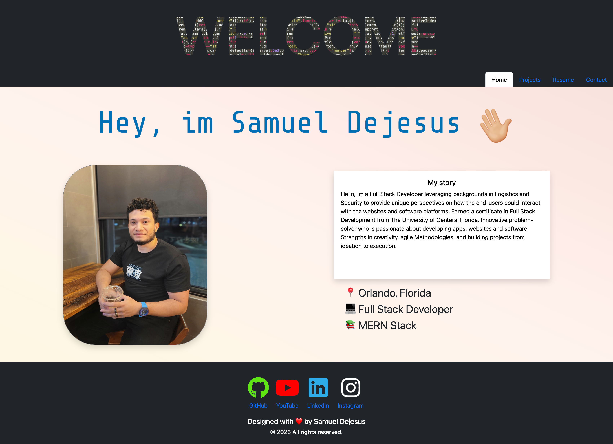

# My React Portfolio

## Deployed Application

https://sam-dejesus.github.io/My-React-Portfolio/

## Description

Hello and welcome! I'm excited to showcase my work in this React-powered portfolio. You will discover a collection of fun, engaging and responsive projects that demonstrate my skills in full-stack development. From fun, clean, and responsive front-end designs to useful, powerful, efficent back-end implementations. This portfolio offers a glimpse into my exciting journey in full-stack development. I hope you enjoy exploring it ❤️!

## Views
**Homepage**

## Contact
Email: sdejesus484@gmail.com
Linkedin: https://www.linkedin.com/in/samuel-dejesus/

